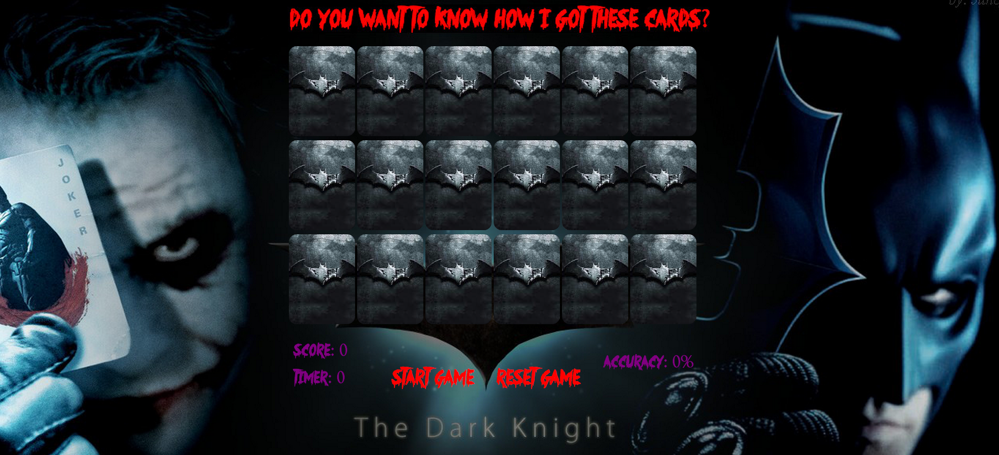

<h1>Memory Match</h1> 

This game has you test your memory to see if you can match cards and if you can remember where they are on the board!

<h2>Game functionality: </h2>
  - Include 18 functioning cards
  - Reveal the front card face when clicking on the back card face
  - Determine whether the first or second card is clicked
  - If it was the second card, compare the first card's front image source with the current card's front image source
  - If the two cards match, both of the cards will disappear
  - If the cards do not match, flip the cards back
  - Inform you when you have matched all cards, and ask if you'd like to play again
  - Game reset button.
  - Accuracy counter - percentage of how many matches you make every 2 clicks

<h2>Things I have learned from this project:</h2>
  - Basic CSS animations
  - Different ways of calling functions (When I started this project, I used only onclick handlers in my html.  I later went back and added click handlers and click handlers with delegates to my javascript file).  
  
